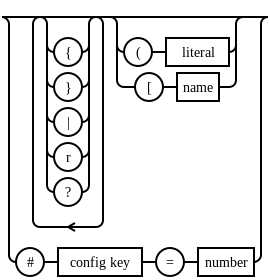

# diagram-in-comment

## What is this?

- You can draw a diagram using the comment block in your code.
- This comment in your source....

````
/*jp.pa-i/syntaxdiagram
{{|({
|(}
|(|
|(r
|(?
r}{|((
[literal
|([
[name
}|(#
[config key
(=
[number
}
*/
````

- ....will be like this(full: https://paijp.github.io/diagram-in-comment/helper/jp.pa-i/syntaxdiagram.html )....



- ....by this command.

```
 $ php diacom.php <helper/jp.pa-i/syntaxdiagram.php >syntaxdiagram.html
```

- And this comment in your source....
```
/*jp.pa-i.cir/cir sip3 U1
22(4[VOUT])2{c104}2[[G]
22(66[VIN])2{c104}2[[G]
22222[[G]
```

- ....will be like this(full: https://paijp.github.io/diagram-in-comment-helper-jp.pa-i.cir/cir.html )....


- ....by installing: https://github.com/paijp/diagram-in-comment-helper-jp.pa-i.cir/


- And you can generate these diagram:
- https://paijp.github.io/smallest-touchpanel-ui/pic32mx/lcdtp.html from this code: https://github.com/paijp/smallest-touchpanel-ui/blob/main/pic32mx/lcdtp.c


## How does it work?

- If you put this code into stdin, 

```
/*sample/type-a
100
110
*/

/*sample/type-b
200
*/

/*sample/type-a
300
*/
```

- diacode.php will do this.

```
$ php sample/type-a.php <<EOO
/*sample/type-a
100
110
*/

/*sample/type-b
200
*/

/*sample/type-a
300
*/
EOO

$ php sample/type-b.php <<EOO
/*sample/type-b
200
*/

/*sample/type-a
300
*/
EOO

$ php sample/type-a.php <<EOO
/*sample/type-a
300
*/
EOO
```

- Each script should process the block before the first '*/'.
- Because some scripts may process the next block of code, or the entire code.

- diacode.php only requires stdin and stdout, so you can run these scripts under Docker.
